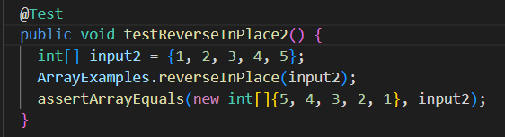
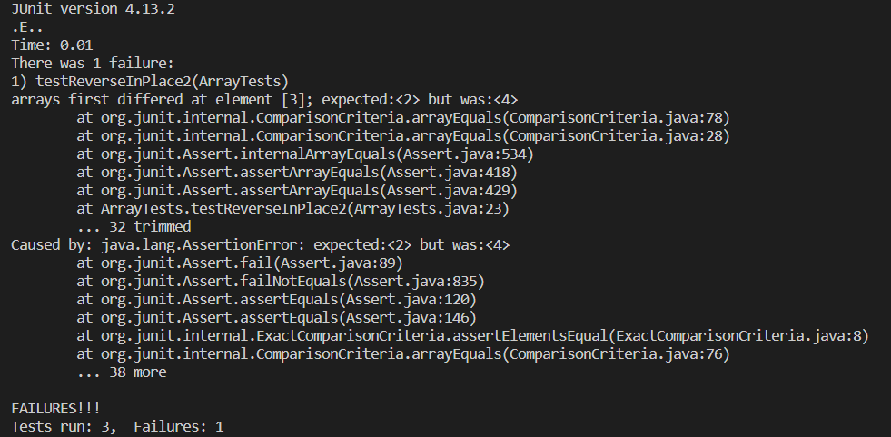
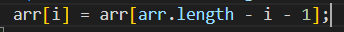
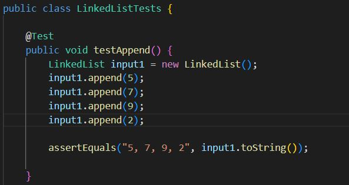
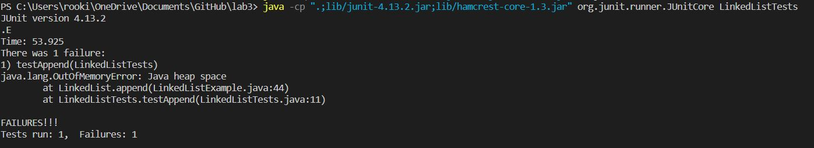

# Part 1

# Part 2

## Reverse In Place bug (Array Tests)

Failure-inducing input:

Symptom:

From this failure message, the array's elements did not change position starting at the latter half of the array. The element [3] was still 4, meaning its position was unaffected.

Bug:

Fixed code:

## Linked List Example bug

The linked list bug was found in the append() function. I'm not quite sure of which line of code seems to be causing the issue, but it results in an out of memory error.

Failure-inducing input:

Symptom:

